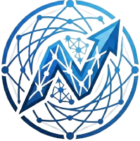

<p align="center">
  
</p>

<h1 align="center">DeepNetz</h1>
<p align="center"><strong>Run massive models on minimal hardware.</strong></p>

[](https://pypi.org/project/deepnetz/)
[](LICENSE)
[]()

```bash
pip install deepnetz

deepnetz pull Qwen3.5-35B                       # download from HuggingFace
deepnetz run Qwen3.5-35B                        # auto-detect hardware, run
deepnetz serve Qwen3.5-35B --port 8080          # OpenAI-compatible API + Web UI
```

Models: [deepnetz.com/models](https://deepnetz.com/models) | Docs: [deepnetz.com](https://deepnetz.com)

## What it does

One framework. 6 backends. Any model. Any hardware.

| You have | Typical setup | With DeepNetz |
|----------|--------------|---------------|
| RTX 4060 8GB + 32GB RAM | 35B model via Ollama | Same model, 3.6x less KV cache, longer context |
| 32GB RAM, no GPU | 7B model, slow | Auto-optimized CPU inference + KV compression |
| RTX 3090 24GB + 64GB RAM | 70B model | Optimized layer split + cache |

## Quick Start

```bash
pip install deepnetz

# Search & download models
deepnetz search Qwen                            # search HuggingFace
deepnetz pull Qwen3.5-35B                       # download best quant for your hardware
deepnetz pull Qwen3.5-35B --quant Q8_0          # specific quantization
deepnetz list                                    # show local models

# Run
deepnetz run Qwen3.5-35B                        # from local store
deepnetz run ./model.gguf                        # local file
deepnetz run ollama://qwen3.5:35b               # from Ollama
deepnetz run hf://unsloth/Qwen3.5-35B-A3B-GGUF  # from HuggingFace
deepnetz run lmstudio://qwen3.5-35b             # from LM Studio

# Options
deepnetz run model.gguf --cpu                    # CPU-only
deepnetz run model.gguf --gpu 8GB --context 32k  # GPU budget + context
deepnetz run model.gguf -p "Explain gravity"     # single prompt

# API server + Web UI
deepnetz serve model.gguf --port 8080
# Web UI:  https://deepnetz.com/app  (connects to localhost)
# API:     http://localhost:8080/v1/chat/completions
# Docs:    http://localhost:8080/docs

# Hardware info
deepnetz hardware
deepnetz backends
```

## Registry

DeepNetz has its own model registry at `registry.deepnetz.com`. Search and pull any GGUF model from HuggingFace through our server.

```bash
# Register & login (one time)
deepnetz register
deepnetz login

# Search models (via registry server → HuggingFace)
deepnetz search Qwen
deepnetz search "code llama"
deepnetz search deepseek

# Pull (auto-selects best quant for your hardware)
deepnetz pull Qwen3.5-35B
deepnetz pull Llama-3.3-70B --quant IQ2_M
deepnetz pull unsloth/Qwen3.5-35B-A3B-GGUF      # direct HF repo
```

Models are stored in `~/.cache/deepnetz/registry/blobs/` as content-addressed files.

## Python API

```python
from deepnetz import Model

# Auto everything
model = Model("model.gguf")
response = model.chat("Hello!")

# Streaming
for token in model.stream("Tell me a story"):
    print(token, end="", flush=True)

# Specific backend
model = Model("ollama://qwen3.5:35b")

# CPU-only with budget
model = Model("model.gguf", cpu_only=True, target_context=8192)
```

## 6 Backends

DeepNetz auto-detects which backends are installed and uses the best one:

| Backend | Source | How it connects |
|---------|--------|----------------|
| **Native** | llama-cpp-python | Direct GGUF inference (fastest) |
| **Ollama** | Ollama REST API | `localhost:11434` |
| **vLLM** | vLLM server | `vllm serve` |
| **LM Studio** | LM Studio API | `localhost:1234` |
| **HuggingFace** | transformers | Pipeline (safetensors) |
| **Remote** | Any OpenAI API | Custom endpoint |

## KV Cache Optimization

Up to 10x memory reduction through stacked compression:

| Technique | Based on | Effect |
|-----------|----------|--------|
| **TurboQuant** | [Google, ICLR 2026](https://arxiv.org/abs/2504.19874) | 3.6x KV compression |
| **Attention Sinks** | [StreamingLLM](https://arxiv.org/abs/2309.17453) | Fixed memory for infinite context |
| **Token Eviction** | [PagedEviction](https://aclanthology.org/2026.findings-eacl.168.pdf) | Remove unimportant tokens |
| **KV Merging** | CaM / D2O | Merge similar tokens |

## Web UI

```bash
deepnetz serve model.gguf --port 8080
# Open http://localhost:8080
```

Professional SPA with 4 pages:
- **Chat** — Streaming, markdown, conversation history, vision, reasoning
- **Models** — Local models + 130+ registry cards, search, load/unload
- **Monitor** — Grafana-style: GPU/CPU/RAM gauges, tok/s sparkline chart
- **Settings** — GPU/CPU toggle, context length, temperature, backend, KV compression

## Vision & Multimodal

Send images to vision models (Gemma 4, Qwen-VL, LLaVA):

```bash
deepnetz run qwen3-vl:8b --image photo.jpg -p "What's in this image?"
deepnetz run qwen3-vl:8b   # interactive: use /image path.jpg
```

## Reasoning Mode

Enable step-by-step reasoning (DeepSeek-R1, QwQ):

```bash
deepnetz run deepseek-r1:14b --reasoning -p "Solve: 2x + 5 = 13"
```

## Speculative Decoding

Use a small draft model for 1.5-2x faster generation:

```bash
deepnetz run Qwen3.5-35B --draft Llama-3.2-3B
```

## Model Optimizer

Analyze models and get optimization recommendations:

```bash
deepnetz optimize model.gguf          # Analysis + recommendations
deepnetz optimize --install-ik-llama  # 1.3-1.5x faster CUDA kernels
deepnetz convert hf://user/repo --quant Q4_K_M   # HF → GGUF
```

## Benchmarks

Tested on RTX 4060 (8GB) + 32GB RAM:

| Model | PPL Delta | Speed | KV Compression |
|-------|-----------|-------|---------------|
| Llama-3.2-3B | +0.4% | — | 3.6x |
| Gemma-3-27B | +2.0% | 2.3 tok/s | 3.6x |
| Qwen3.5-35B | +2.7% | 7.4 tok/s | 3.6x |
| Llama-3.3-70B | — | 0.7 tok/s | — |
| Qwen3.5-122B | — | 1.3 tok/s | — |

## Architecture

```
deepnetz/
├── cli.py                       # CLI (run/serve/pull/search/list/register/login)
├── server.py                    # FastAPI + OpenAI API + WebSocket
├── engine/
│   ├── model.py                 # Main orchestrator
│   ├── manager.py               # Model lifecycle (load/unload/switch)
│   ├── hardware.py              # GPU/CPU/RAM detection
│   ├── monitor.py               # Real-time system stats
│   ├── planner.py               # Budget → inference plan
│   ├── session.py               # SQLite conversation persistence
│   ├── resolver.py              # Universal model resolver (8 sources)
│   ├── downloader.py            # Model download wrapper
│   ├── features.py              # Vision, Reasoning, Tool Calling, MoE detection
│   ├── speculative.py           # Token-level speculative decoding
│   ├── optimize.py              # Model analysis + optimization recommendations
│   ├── converter.py             # HF → GGUF converter
│   ├── gguf_reader.py           # GGUF metadata extraction
│   ├── scanner.py               # Local model discovery
│   └── evaluator.py             # Output quality scoring
├── registry/
│   ├── store.py                 # Local blob store + HF pull
│   ├── client.py                # Registry server client (auth, search)
│   ├── server.py                # Registry server (deploy on your infra)
│   └── config.py                # Model config format
├── backends/                    # 6 pluggable adapters
│   ├── native.py, ollama.py, vllm.py
│   ├── lmstudio.py, huggingface.py, remote.py
│   └── discovery.py             # Auto-detect backends
├── cache/                       # KV cache optimization
│   ├── turboquant.py, eviction.py, merging.py
├── tools/                       # Tool calling
│   ├── search.py, registry.py, base.py
└── ui/                          # Web UI templates
```

## Comparison

| Feature | Ollama | LM Studio | vLLM | **DeepNetz** |
|---------|--------|-----------|------|-------------|
| Load from anywhere | Own registry | Own catalog | HuggingFace | **All of them** |
| KV Cache Compression | No | No | No | **q4_0/q8_0 (3.6x)** |
| Multi-Backend | No | No | No | **6 backends** |
| Hardware Auto-Tuning | Basic | Basic | No | **Budget planner** |
| Vision/Multimodal | No | Yes | No | **Yes (API + UI)** |
| Reasoning Mode | No | No | No | **Yes (think tags)** |
| Speculative Decoding | No | Experimental | No | **Token-level** |
| Model Optimizer | No | No | No | **APEX + ik_llama** |
| MoE Detection | No | No | No | **APEX recommendations** |
| Web UI | No | Yes (closed) | No | **Yes (hosted + local)** |
| Model Registry | Proprietary | No | No | **Own + HuggingFace** |
| OAuth Login | No | No | No | **GitHub + Google** |
| Tool Calling | No | No | Yes | **Yes + Web Search** |

## Contributing

```bash
git clone https://github.com/Keyvanhardani/deepnetz.git
cd deepnetz
pip install -e ".[server]"
pytest tests/
```

## License

MIT
